# MyOpty - Flanet Opticals Website

A modular monolith Spring Boot application for Flanet Opticals, Narammala.  
Four distinct business systems, each owned by a team member.

---

## System Architecture (4 Modules)

| Module | Package | Owner | Student ID | Epics |
|--------|---------|-------|------------|-------|
| **Catalog & Inventory** | `com.myopty.catalog` | Amarasekara K.N. | IT25103193 | 1, 2 (browsing), 5 |
| **Order & Prescription** | `com.myopty.order` | Welikuburawatta M.D.L | IT25300262 | 3, 6, 5 (stock updates) |
| **Workflow & Communication** | `com.myopty.workflow` | Karunarathna KHMMM | IT25101670 | 7, 8, 9 |
| **Payment & Billing** | `com.myopty.billing` | Kankanamge P M G | IT24300359 | 4 |

**Shared Infrastructure:** `com.myopty.shared` - Auth, Users, Q&A, Config (team-wide)

---

## Module Responsibilities Detail

### 1. Catalog & Inventory System (Amarasekara K.N.)
**Package:** `com.myopty.catalog`

**Core Domain:**
- **Frame** - model, color, material, price, stock, category, images
- **Lens** - type (single/bifocal/progressive), coating, price, stock, category
- **Category** - hierarchical categories for frames/lenses (men/women/kids, etc.)
- **StockEntry** - audit log of all stock changes (sales, returns, new stock, adjustments)
- **AvailabilityReport** - generated snapshots of inventory health

**Key Features:**
- CRUD for frames, lenses, categories
- Real-time stock tracking with auto-decrement on order placement
- Availability dashboard: in-stock / low-stock / out-of-stock counts
- Low-stock alerts (configurable thresholds)
- PDF/Excel export of availability reports
- Customer-facing: browse, filter (category, price, color, material), search, sort

**API Endpoints (Planned):**
```
GET    /api/frames                    # List with filters, pagination
GET    /api/frames/{id}               # Detail
POST   /api/frames                    # Create (client only)
PUT    /api/frames/{id}               # Update (client only)
DELETE /api/frames/{id}               # Discontinue (client only)
GET    /api/lenses                    # List with filters
GET    /api/lenses/{id}               # Detail
POST   /api/lenses                    # Create (client only)
PUT    /api/lenses/{id}               # Update (client only)
GET    /api/categories                # All categories
GET    /api/inventory/report          # Availability report
GET    /api/inventory/alerts          # Low-stock alerts
POST   /api/inventory/report/export   # Export PDF/Excel
```

**Database Tables:** `category`, `frame`, `lens`, `stock_entry`, `availability_report`

---

### 2. Order & Prescription System (Welikuburawatta M.D.L)
**Package:** `com.myopty.order`

**Core Domain:**
- **Prescription** - sphere/cylinder/axis/add power, document upload, verification status
- **ProgressiveOrder** - links prescription + frame + lens, workflow status, receive dates
- **Discount** - percentage, validity period, target items (bulk via JSON), history
- **StockUpdate** - receiving new stock from dealers, quantity + cost tracking

**Key Features:**
- Prescription form with all optical fields + document upload
- Progressive order workflow: PENDING → APPROVED → PROCESSING → READY → DISPATCHED
- Client review/approve/reject prescriptions
- Estimated receive date calculation (based on lens type, stock, lab time)
- Discount engine: create/edit/end rules, bulk apply, history log
- New stock intake: record quantity, cost, supplier, auto-increment stock
- Customer notifications on status changes

**API Endpoints (Planned):**
```
POST   /api/prescriptions                  # Submit prescription (customer)
GET    /api/prescriptions/{id}             # View prescription
PUT    /api/prescriptions/{id}/verify      # Client verify/reject
POST   /api/orders/progressive             # Create progressive order
GET    /api/orders/progressive             # List (client: all; customer: own)
GET    /api/orders/progressive/{id}        # Detail
PUT    /api/orders/progressive/{id}/status # Update status (client)
GET    /api/orders/progressive/{id}/receive-date # Estimated date
POST   /api/discounts                      # Create discount (client)
GET    /api/discounts                      # List (with active filter)
PUT    /api/discounts/{id}                 # Update discount
DELETE /api/discounts/{id}                 # End early
POST   /api/stock/updates                  # Record new stock (client)
GET    /api/stock/updates                  # History
```

**Database Tables:** `prescription`, `progressive_order`, `discount`, `stock_update`

---

### 3. Workflow & Communication System (Karunarathna KHMMM)
**Package:** `com.myopty.workflow`

**Core Domain:**
- **TodoTask** - Kanban board tasks with status, priority, due dates, order linkage
- **MonthlyReport** - sales, orders, revenue, stock movement, new customers per month
- **Dealer** - contact info, item type (frame/lens/both), active status
- **DealerEmail** - composed/auto-generated emails, status tracking, order references

**Key Features:**
- Task board: create, drag-drop status (PENDING → IN_PROGRESS → DONE)
- Order-processing queue (FIFO) auto-created from new orders
- Priority levels (HIGH/MEDIUM/LOW) with visual indicators
- Overdue task reminders (email/notification)
- Monthly reports: auto-generate + manual trigger, PDF/Excel export
- Dashboard: key metrics cards (today's sales, low stock count, pending tasks, pending orders)
- Dealer management: CRUD contacts
- Auto-calculate reorder quantities from low-stock items
- Auto-generate dealer order emails from calculated needs
- Client review/approve before send
- Email status tracking: DRAFT → SENT → REPLIED → FULFILLED

**API Endpoints (Planned):**
```
POST   /api/tasks                        # Create task
GET    /api/tasks                        # List (filter: status, priority, assignee)
PUT    /api/tasks/{id}                   # Update task
PUT    /api/tasks/{id}/status            # Update status (Kanban)
DELETE /api/tasks/{id}                   # Delete
GET    /api/tasks/queue                  # Order-processing queue
POST   /api/reports/monthly              # Generate monthly report
GET    /api/reports/monthly              # List reports
GET    /api/reports/monthly/{id}         # View report
POST   /api/reports/monthly/{id}/export  # Export PDF/Excel
GET    /api/dashboard                    # Key metrics summary
POST   /api/dealers                      # Create dealer
GET    /api/dealers                      # List dealers
PUT    /api/dealers/{id}                 # Update dealer
POST   /api/dealer-emails                # Compose email
POST   /api/dealer-emails/auto-generate  # Auto-generate from low stock
GET    /api/dealer-emails                # List with status
PUT    /api/dealer-emails/{id}/send      # Send approved email
```

**Database Tables:** `todo_task`, `monthly_report`, `dealer`, `dealer_email`

---

### 4. Payment & Billing System (Kankanamge P M G)
**Package:** `com.myopty.billing`

**Core Domain:**
- **PaymentMethod** - card, bank transfer, cash on pickup; provider config in JSON
- **Payment** - links order+customer+method, gateway transaction ID, status, refunds
- **Invoice** - generated per payment, line items, PDF generation, tax/discount breakdown
- **BillingReport** - monthly revenue, payment breakdown by method, refunds, net revenue

**Key Features:**
- Checkout page with multiple payment methods
- Payment gateway integration (configurable provider)
- Authorization → capture flow for online payments
- Cash-on-pickup: manual confirmation by client
- Payment confirmation screen + email receipt
- Invoice auto-generation on successful payment
- PDF invoice generation with line items
- Refund processing (full/partial) with gateway integration
- Customer payment history in account
- Client: payment list with filters (date, status, method)
- Billing reports: monthly revenue, by payment method, refunds

**API Endpoints (Planned):**
```
GET    /api/payment-methods              # Active methods for checkout
POST   /api/payments                     # Initiate payment
GET    /api/payments/{id}                # Payment status
PUT    /api/payments/{id}/capture        # Capture authorized (if needed)
POST   /api/payments/{id}/refund         # Refund (client)
GET    /api/payments                     # List (client: all; customer: own)
GET    /api/invoices/{id}                # View invoice
GET    /api/invoices/{id}/pdf            # Download PDF
POST   /api/billing/reports              # Generate monthly billing report
GET    /api/billing/reports              # List reports
GET    /api/billing/reports/{id}         # View report
POST   /api/billing/reports/{id}/export  # Export PDF/Excel
```

**Database Tables:** `payment_method`, `payment`, `invoice`, `billing_report`

---

### 5. Shared Infrastructure (Team-Wide)
**Package:** `com.myopty.shared`

**Core Domain:**
- **AppUser** - unified user table with role (CUSTOMER/CLIENT)
- **ClientProfile** - shop details (extends AppUser)
- **CustomerProfile** - preferences (extends AppUser)
- **Question** - Q&A/FAQ system

**Key Features:**
- JWT-based authentication
- Role-based access control (CUSTOMER vs CLIENT)
- Registration with email/phone verification (OTP)
- Login/logout, password reset
- Profile management
- Q&A: customers ask, clients answer, FAQ marking
- Global exception handling, validation, audit logging

**API Endpoints (Planned):**
```
POST   /api/auth/register                # Register (customer/client)
POST   /api/auth/login                   # Login
POST   /api/auth/refresh                 # Refresh token
POST   /api/auth/forgot-password         # Request reset
POST   /api/auth/reset-password          # Reset with token
GET    /api/auth/me                      # Current user profile
PUT    /api/auth/me                      # Update profile
POST   /api/questions                    # Ask question (customer)
GET    /api/questions                    # List (customer: own; client: all)
PUT    /api/questions/{id}/answer        # Answer question (client)
GET    /api/questions/faq                # Public FAQ
```

**Database Tables:** `app_user`, `client_profile`, `customer_profile`, `question`

---

## Cross-Module Integration Points

| From Module | To Module | Integration Pattern |
|-------------|-----------|---------------------|
| Order | Catalog | Read frame/lens stock, decrement on order |
| Order | Billing | Create payment record on order confirmation |
| Order | Workflow | Auto-create task in order-processing queue |
| Workflow | Catalog | Read low-stock for auto-generate dealer emails |
| Workflow | Order | Read pending orders for queue, summarize for reports |
| Billing | Order | Read order total for payment amount |
| All | Shared | Auth, user lookup, current user context |

**Integration Rules:**
- Modules communicate via **service interfaces** (not direct repository access)
- Shared kernel: only `shared` module entities (AppUser, enums)
- Events for async: `OrderPlacedEvent`, `StockChangedEvent`, `PaymentCompletedEvent`
- No circular dependencies between feature modules

---

## Development Workflow

### Branch Naming
```
<type>/<module>-<short-description>
```
Examples:
- `feat/catalog-add-frame-crud`
- `fix/order-prescription-validation`
- `docs/workflow-api-spec`

### Commit Messages (Conventional Commits)
```
<type>[optional scope]: <description>

[optional body]
```
Types: `feat`, `fix`, `docs`, `style`, `refactor`, `perf`, `test`, `chore`

### Module Ownership
- Each student owns their package end-to-end (controller → service → repository → migration)
- Shared code in `com.myopty.shared` requires team consensus
- Cross-module references: use **service interfaces** or **events**, not direct entity access

### Database Migrations
- Each module owns its tables → creates its own Flyway migration files
- Naming: `V<version>__<module>_<description>.sql`
- Example: `V2__catalog_create_frame_table.sql`

---

## API Design Guidelines

- RESTful, plural nouns: `/api/frames`, `/api/orders/progressive`
- Version in URL if breaking: `/api/v1/...`
- Standard responses:
  ```json
  { "success": true, "data": {...}, "meta": {...} }
  { "success": false, "error": { "code": "...", "message": "..." } }
  ```
- Pagination: `?page=0&size=20&sort=createdAt,desc`
- Filtering: `?category=men&minPrice=1000&maxPrice=5000`

---

## Technology Stack

| Layer | Technology |
|-------|------------|
| Backend | Spring Boot 4.1.1, Spring MVC, Spring Data JDBC |
| Database | MySQL (Flyway migrations) |
| API Docs | SpringDoc OpenAPI 3 (Swagger UI) |
| Build | Maven Wrapper (`./mvnw`) |
| Container | Docker Compose |
| Frontend | *To be decided* |

---

## Getting Started

### Prerequisites
- Java 26
- Docker & Docker Compose (for MySQL)
- Maven (or use `./mvnw`)

### Backend

```bash
cd backend

# Start MySQL via Docker Compose
docker compose up -d

# Run Flyway migrations (auto on startup)
./mvnw spring-boot:run
```

API will be available at `http://localhost:8080`  
Swagger UI at `http://localhost:8080/swagger-ui.html`

### Frontend

```bash
cd frontend
# Instructions TBD once framework is chosen
```

---

## Testing

```bash
# Unit + integration tests
./mvnw test

# Specific module
./mvnw test -pl backend -Dtest=*Catalog*
```

---

## Deployment

```bash
# Build Docker image
./mvnw spring-boot:build-image

# Or use compose for full stack
docker compose -f compose.yaml -f compose.prod.yaml up -d
```

---

## Documentation

- **Project Plan & Diagrams:** `MyOpty_Project_Plan.md`
- **System Architecture (this file):** `README.md`
- **Contribution Guide:** `CONTRIBUTION.md`
- **API Docs (running):** `http://localhost:8080/swagger-ui.html`

---

# Project Plan: Epics, User Stories & Diagrams

**Group 12**  
**Client:** R.A. Kanchana Krishan - Flanet Opticals, Narammala  
**Team:**
| Member | ID | Responsibility |
|---|---|---|
| Amarasekara K.N. | IT25103193 | Lens & Frames database and availability report |
| Welikuburawatta M.D.L | IT25300262 | Progressive line, discount update & new stock update |
| Karunarathna KHMMM | IT25101670 | To-do work flow, monthly report & dealer communication |
| Kankanamge P M G | IT24300359 | Payment & Billing |

---

## Actors

| Actor | Description |
|---|---|
| Customer / Visitor | Browses the site, registers, orders frames/lenses, pays |
| Client (Shop Owner) | Manages inventory, discounts, tasks, dealer communication, reports |
| Frame Dealer | Supplies frames, receives stock-request emails |
| Lens Dealer | Supplies lenses, receives stock-request emails |
| Payment Gateway | Processes customer payments |

---

## Epics & User Stories (Granular)

### Epic 0 - Project Setup & Configuration *(whole team, before feature work starts)*
- As a **developer**, I want to initialize a Git repository and branching strategy so that the team can collaborate without overwriting each other's work.
- As a **developer**, I want to set up the project folder structure (frontend, backend, database, docs) so that code stays organized from the start.
- As a **developer**, I want to configure the local development environment (runtime, package manager, `.env` file) so that every team member can run the project identically.
- As a **developer**, I want to install and configure the chosen frontend and backend frameworks so that development can begin on a working skeleton.
- As a **developer**, I want to set up the database server and create the initial schema (tables from the EER diagram) so that data can be stored from day one.
- As a **developer**, I want to seed the database with sample frame/lens/discount data so that the team can test features against realistic data.
- As a **developer**, I want to configure a local/staging web server so that the site can be previewed during development.
- As a **developer**, I want to register and configure a payment gateway sandbox account so that payment features can be built and tested safely.
- As a **developer**, I want to configure an email-sending service (SMTP/API key) so that Q&A notifications and dealer emails can be sent from the system.
- As a **developer**, I want to set up basic authentication and session handling (customer vs. client roles) so that access control works before other features are layered on.
- As a **developer**, I want to set up a shared coding standard, linter, and README so that all contributors follow consistent practices.
- As a **project lead**, I want to set up a task board (e.g., to-do wall/Trello/Jira) mapped to the four individual responsibilities so that progress can be tracked from the start.
- As a **developer**, I want to configure version control ignore rules and environment secrets handling so that sensitive credentials are never committed.
- As a **developer**, I want to set up a basic CI check (build/lint on push) so that broken code is caught early.
- As a **developer**, I want to document the deployment plan (hosting provider, domain) so that going live at the end of the project is straightforward.

### Epic 1 - Customer Shopping & Browsing *(shared/foundational)*
- As a **customer**, I want to view a list/grid of all frames so that I can browse available styles.
- As a **customer**, I want to filter frames by category (men, women, kids) so that I can narrow my search.
- As a **customer**, I want to filter frames by price range so that I can shop within my budget.
- As a **customer**, I want to filter frames by color or material so that I can find my preferred style.
- As a **customer**, I want to search frames by keyword or model name so that I can quickly find a specific item.
- As a **customer**, I want to open a frame's detail page (images, price, stock status) so that I can decide whether to purchase.
- As a **customer**, I want to view a list/grid of all lenses so that I can browse lens options.
- As a **customer**, I want to filter lenses by type (single vision, bifocal, progressive) so that I can find the right lens.
- As a **customer**, I want to open a lens's detail page (coating, price, description) so that I can make an informed choice.
- As a **customer**, I want to see a "New Arrivals" section so that I know about the latest frames/lenses.
- As a **customer**, I want discounted items visually tagged so that I can identify offers quickly.
- As a **customer**, I want to sort frames/lenses by price or popularity so that I can browse more efficiently.

### Epic 2 - Customer Registration & Support *(shared/foundational)*
- As a **customer**, I want to sign up with my name, email, phone, and password so that I can create an account.
- As a **customer**, I want to verify my email or phone (OTP/link) so that my account is secure.
- As a **customer**, I want to log in and log out so that I can access my account securely.
- As a **customer**, I want to reset my password so that I can regain access if I forget it.
- As a **customer**, I want to edit my profile details so that my information stays up to date.
- As a **customer**, I want to submit a question through the Q&A section so that I can ask about a product.
- As a **customer**, I want to view previously asked questions and answers (FAQ) so that I don't need to ask duplicates.
- As a **client**, I want to view a list of unanswered questions so that I can respond to them.
- As a **client**, I want to post an answer to a customer's question so that the customer is notified.
- As a **customer**, I want to receive a notification/email when my question is answered so that I stay informed.

### Epic 3 - Prescription & Progressive Lens Ordering *(Welikuburawatta)*
- As a **customer**, I want to fill in a prescription form (sphere, cylinder, axis, add power) so that my lens can be customized correctly.
- As a **customer**, I want to upload a scanned or photographed prescription document so that the shop can verify it.
- As a **customer**, I want to select "progressive lens" as an order type so that my order is routed to the correct workflow.
- As a **customer**, I want to link my prescription to a specific frame/lens order so that everything is processed together.
- As a **client**, I want to review a submitted prescription for completeness so that I can flag missing details.
- As a **client**, I want to approve or reject a progressive lens order so that only valid orders proceed to production.
- As a **customer**, I want to see an estimated receive date after order approval so that I know when to expect my order.
- As a **client**, I want to update the order status (processing, ready, dispatched) so that the customer stays informed.
- As a **customer**, I want to receive a notification when my order status changes so that I can plan pickup.

### Epic 4 - Payment & Billing *(Kankanamge)*
- As a **customer**, I want to view a list of accepted payment methods (card, bank transfer, cash on pickup) so that I can choose one.
- As a **customer**, I want to enter my payment details on a secure checkout page so that my transaction is protected.
- As the **system**, I want to send payment details to the payment gateway for authorization so that payments are validated externally.
- As a **customer**, I want to see a payment confirmation screen so that I know my payment succeeded.
- As a **customer**, I want to receive an emailed invoice/receipt so that I have proof of purchase.
- As a **client**, I want to view a list of all payments so that I can track incoming revenue.
- As a **client**, I want to filter payments by date range or status so that I can reconcile records.
- As a **customer**, I want to view my payment and order history in my account so that I can track past purchases.
- As a **client**, I want to issue a refund for a cancelled order so that the customer is reimbursed correctly.

### Epic 5 - Inventory & Stock Management *(Amarasekara + partly Welikuburawatta)*
- As a **client**, I want to add a new frame record (model, color, material, price, stock quantity) so that it appears on the site.
- As a **client**, I want to edit an existing frame record so that its details stay accurate.
- As a **client**, I want to discontinue/delete a frame record so that it's removed from the shop wall.
- As a **client**, I want to add a new lens record so that it appears in the lens collection.
- As a **client**, I want to edit an existing lens record so that its details stay accurate.
- As a **client**, I want to organize frames and lenses into categories so that browsing is structured.
- As the **system**, I want stock quantity to auto-decrease when an order is placed so that inventory stays accurate.
- As a **client**, I want to view a real-time availability report (in stock / low stock / out of stock) so that I can plan reorders.
- As a **client**, I want to receive a low-stock alert so that I can act before an item runs out.
- As a **client**, I want to export the availability report (PDF/Excel) so that I can share or archive it.

### Epic 6 - Discount Management *(Welikuburawatta)*
- As a **client**, I want to create a discount rule (percentage, target item, validity period) so that promotions can run.
- As a **client**, I want to edit or end a discount early so that I can adjust promotions as needed.
- As a **client**, I want to apply a discount to multiple items at once (bulk discount) so that I can run store-wide sales.
- As a **customer**, I want to see the discounted price clearly next to the original price so that I understand my savings.
- As a **client**, I want to view a log of past discounts so that I can review promotion history.

### Epic 7 - Client Task & Workflow Management *(Karunarathna)*
- As a **client**, I want to create a to-do task with a title, description, and due date so that I can track work items.
- As a **client**, I want to view all to-do tasks on a wall/board so that I can see my workload at a glance.
- As a **client**, I want to update a task's status (pending, in-progress, done) so that I can track progress.
- As a **client**, I want to prioritize tasks (high/medium/low) so that urgent work is visible first.
- As a **client**, I want a dedicated order-processing queue (to-do work flow) so that pending orders are handled in the order received.
- As a **client**, I want to mark an order task as complete so that it's removed from the active queue.
- As a **client**, I want to receive a reminder for overdue tasks so that nothing is missed.

### Epic 8 - Dealer Communication & Ordering *(Karunarathna)*
- As a **client**, I want to maintain a list of dealer contacts (name, email, item type) so that I know who to contact.
- As a **client**, I want to manually compose an email to a dealer so that I can request specific stock.
- As the **system**, I want to auto-calculate needed stock based on low inventory so that the client doesn't have to calculate manually.
- As the **system**, I want to auto-generate a stock-request email from the calculated needs so that the client saves time drafting.
- As a **client**, I want to review and approve an auto-generated email before it's sent so that I retain control over communications.
- As a **dealer**, I want to receive a clearly formatted order email so that I can fulfil the request accurately.
- As a **client**, I want to track sent dealer emails and their status (sent, replied, fulfilled) so that I can follow up.

### Epic 9 - Reporting & Analytics *(Karunarathna)*
- As a **client**, I want a monthly sales report (total orders, total revenue) so that I can review business performance.
- As a **client**, I want a monthly inventory report (stock added/sold) so that I can review stock movement.
- As a **client**, I want to view historical reports by month/year so that I can compare performance over time.
- As a **client**, I want to export reports (PDF/Excel) so that I can share them or keep records.
- As a **client**, I want a dashboard summarizing key metrics (sales, low stock, pending tasks) so that I get a quick daily overview.

---

## Full Project Diagrams

### Use Case Diagram - Full System

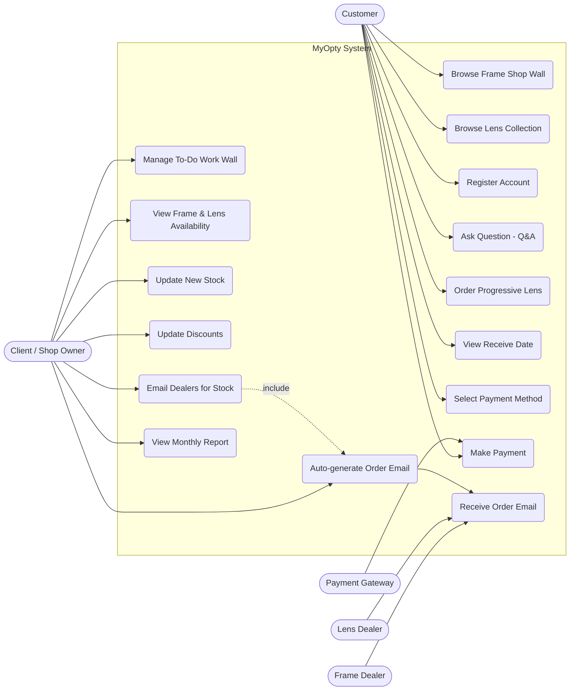
```mermaid
flowchart LR
    Customer([Customer])
    Client([Client / Shop Owner])
    FrameDealer([Frame Dealer])
    LensDealer([Lens Dealer])
    PayGate([Payment Gateway])

    subgraph MyOpty System
        UC1(Browse Frame Shop Wall)
        UC2(Browse Lens Collection)
        UC3(Register Account)
        UC4(Ask Question - Q&A)
        UC5(Order Progressive Lens)
        UC6(View Receive Date)
        UC7(Select Payment Method)
        UC8(Make Payment)
        UC9(Manage To-Do Work Wall)
        UC10(View Frame & Lens Availability)
        UC11(Update New Stock)
        UC12(Update Discounts)
        UC13(Email Dealers for Stock)
        UC14(Auto-generate Order Email)
        UC15(View Monthly Report)
        UC16(Receive Order Email)
    end

    Customer --> UC1
    Customer --> UC2
    Customer --> UC3
    Customer --> UC4
    Customer --> UC5
    Customer --> UC6
    Customer --> UC7
    Customer --> UC8

    Client --> UC9
    Client --> UC10
    Client --> UC11
    Client --> UC12
    Client --> UC13
    Client --> UC14
    Client --> UC15

    PayGate --> UC8
    FrameDealer --> UC16
    LensDealer --> UC16
    UC13 -.include.-> UC14
    UC14 --> UC16
```

### EER Diagram - Full System

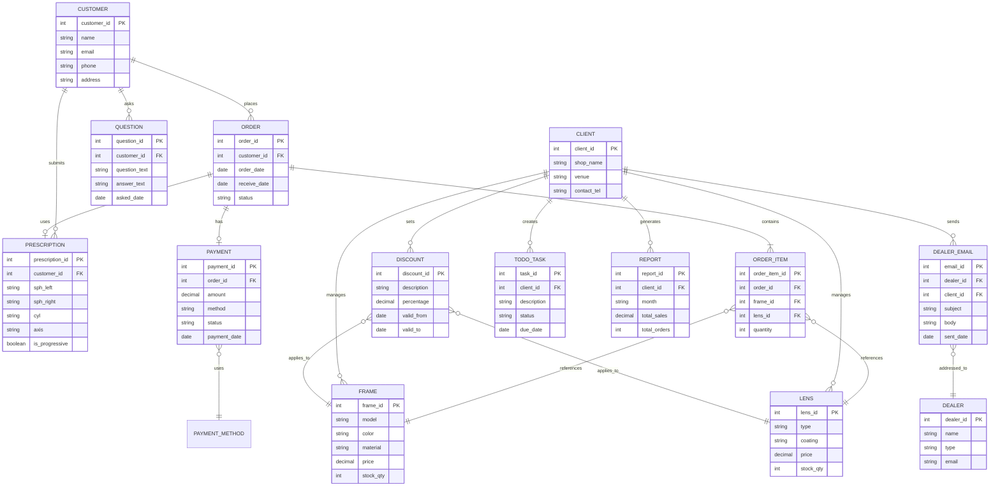
```mermaid
erDiagram
    CUSTOMER ||--o{ ORDER : places
    CUSTOMER ||--o{ QUESTION : asks
    CUSTOMER ||--o{ PRESCRIPTION : submits
    ORDER ||--|{ ORDER_ITEM : contains
    ORDER_ITEM }o--|| FRAME : references
    ORDER_ITEM }o--|| LENS : references
    ORDER ||--o| PAYMENT : has
    ORDER ||--o| PRESCRIPTION : uses
    CLIENT ||--o{ FRAME : manages
    CLIENT ||--o{ LENS : manages
    CLIENT ||--o{ DISCOUNT : sets
    CLIENT ||--o{ TODO_TASK : creates
    CLIENT ||--o{ REPORT : generates
    CLIENT ||--o{ DEALER_EMAIL : sends
    DEALER_EMAIL }o--|| DEALER : addressed_to
    DISCOUNT }o--|| FRAME : applies_to
    DISCOUNT }o--|| LENS : applies_to
    PAYMENT }o--|| PAYMENT_METHOD : uses

    CUSTOMER {
        int customer_id PK
        string name
        string email
        string phone
        string address
    }
    CLIENT {
        int client_id PK
        string shop_name
        string venue
        string contact_tel
    }
    FRAME {
        int frame_id PK
        string model
        string color
        string material
        decimal price
        int stock_qty
    }
    LENS {
        int lens_id PK
        string type
        string coating
        decimal price
        int stock_qty
    }
    ORDER {
        int order_id PK
        int customer_id FK
        date order_date
        date receive_date
        string status
    }
    ORDER_ITEM {
        int order_item_id PK
        int order_id FK
        int frame_id FK
        int lens_id FK
        int quantity
    }
    PRESCRIPTION {
        int prescription_id PK
        int customer_id FK
        string sph_left
        string sph_right
        string cyl
        string axis
        boolean is_progressive
    }
    PAYMENT {
        int payment_id PK
        int order_id FK
        decimal amount
        string method
        string status
        date payment_date
    }
    DISCOUNT {
        int discount_id PK
        string description
        decimal percentage
        date valid_from
        date valid_to
    }
    TODO_TASK {
        int task_id PK
        int client_id FK
        string description
        string status
        date due_date
    }
    REPORT {
        int report_id PK
        int client_id FK
        string month
        decimal total_sales
        int total_orders
    }
    DEALER {
        int dealer_id PK
        string name
        string type
        string email
    }
    DEALER_EMAIL {
        int email_id PK
        int dealer_id FK
        int client_id FK
        string subject
        string body
        date sent_date
    }
    QUESTION {
        int question_id PK
        int customer_id FK
        string question_text
        string answer_text
        date asked_date
    }
```

### Class Diagram - Full System

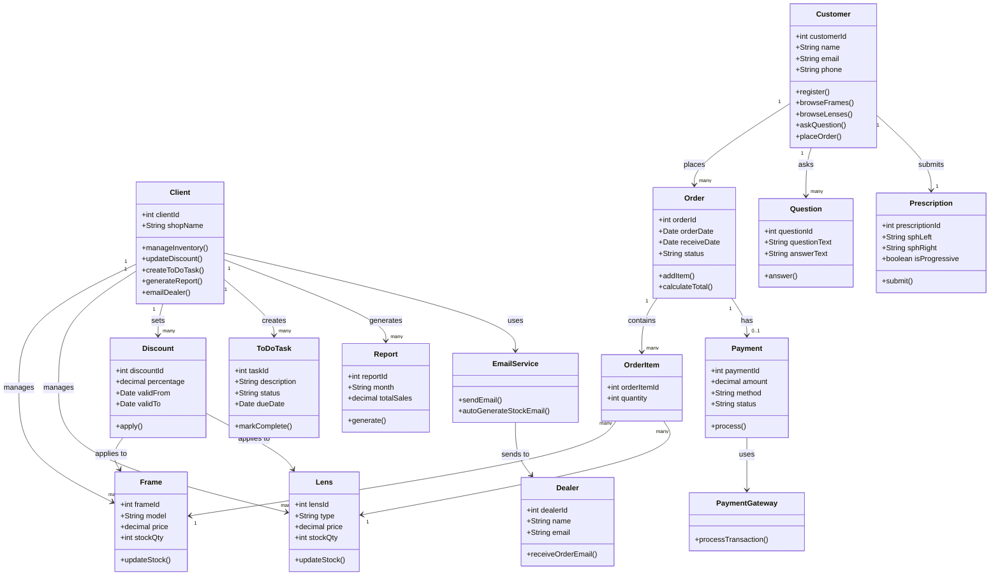
```mermaid
classDiagram
    class Customer {
        +int customerId
        +String name
        +String email
        +String phone
        +register()
        +browseFrames()
        +browseLenses()
        +askQuestion()
        +placeOrder()
    }
    class Client {
        +int clientId
        +String shopName
        +manageInventory()
        +updateDiscount()
        +createToDoTask()
        +generateReport()
        +emailDealer()
    }
    class Dealer {
        +int dealerId
        +String name
        +String email
        +receiveOrderEmail()
    }
    class Frame {
        +int frameId
        +String model
        +decimal price
        +int stockQty
        +updateStock()
    }
    class Lens {
        +int lensId
        +String type
        +decimal price
        +int stockQty
        +updateStock()
    }
    class Order {
        +int orderId
        +Date orderDate
        +Date receiveDate
        +String status
        +addItem()
        +calculateTotal()
    }
    class OrderItem {
        +int orderItemId
        +int quantity
    }
    class Prescription {
        +int prescriptionId
        +String sphLeft
        +String sphRight
        +boolean isProgressive
        +submit()
    }
    class Payment {
        +int paymentId
        +decimal amount
        +String method
        +String status
        +process()
    }
    class Discount {
        +int discountId
        +decimal percentage
        +Date validFrom
        +Date validTo
        +apply()
    }
    class ToDoTask {
        +int taskId
        +String description
        +String status
        +Date dueDate
        +markComplete()
    }
    class Report {
        +int reportId
        +String month
        +decimal totalSales
        +generate()
    }
    class Question {
        +int questionId
        +String questionText
        +String answerText
        +answer()
    }
    class EmailService {
        +sendEmail()
        +autoGenerateStockEmail()
    }
    class PaymentGateway {
        +processTransaction()
    }

    Customer "1" --> "many" Order : places
    Customer "1" --> "many" Question : asks
    Customer "1" --> "1" Prescription : submits
    Order "1" --> "many" OrderItem : contains
    OrderItem "many" --> "1" Frame
    OrderItem "many" --> "1" Lens
    Order "1" --> "0..1" Payment : has
    Payment --> PaymentGateway : uses
    Client "1" --> "many" Frame : manages
    Client "1" --> "many" Lens : manages
    Client "1" --> "many" Discount : sets
    Client "1" --> "many" ToDoTask : creates
    Client "1" --> "many" Report : generates
    Client --> EmailService : uses
    EmailService --> Dealer : sends to
    Discount --> Frame : applies to
    Discount --> Lens : applies to
```

---

## Task-Level Diagrams

### Amarasekara K.N. - Lens & Frames Database and Availability Report

**Use Case Diagram**
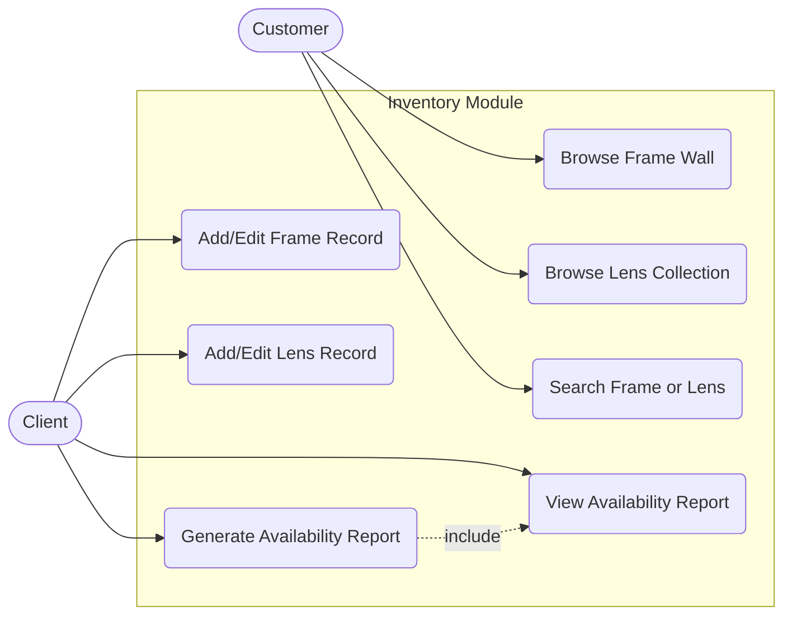
```mermaid
flowchart LR
    Customer([Customer])
    Client([Client])

    subgraph Inventory Module
        UC1(Browse Frame Wall)
        UC2(Browse Lens Collection)
        UC3(Search Frame or Lens)
        UC4(View Availability Report)
        UC5(Add/Edit Frame Record)
        UC6(Add/Edit Lens Record)
        UC7(Generate Availability Report)
    end

    Customer --> UC1
    Customer --> UC2
    Customer --> UC3
    Client --> UC4
    Client --> UC5
    Client --> UC6
    Client --> UC7
    UC7 -.include.-> UC4
```

**EER Diagram**
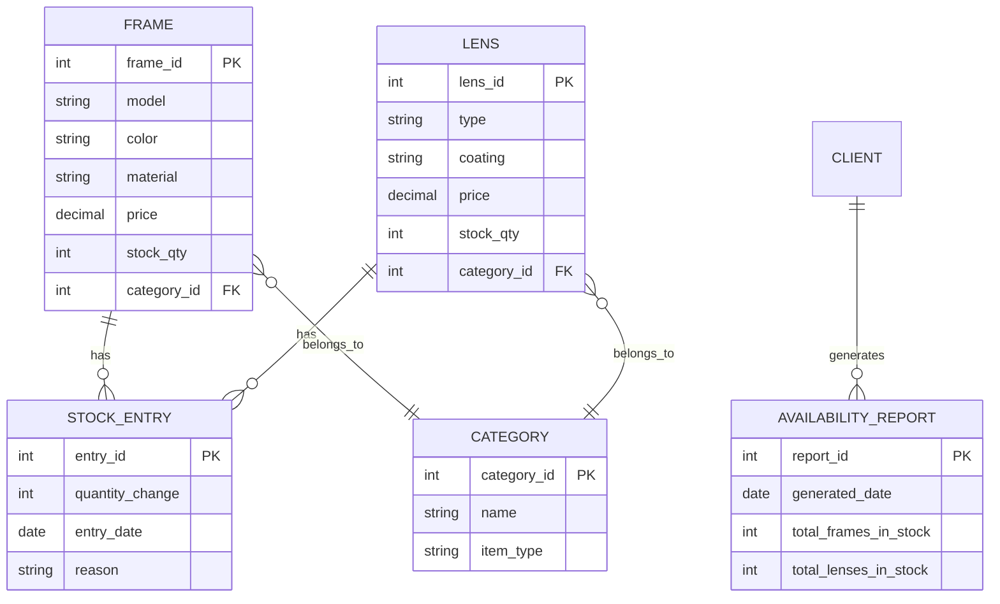
```mermaid
erDiagram
    FRAME ||--o{ STOCK_ENTRY : has
    LENS ||--o{ STOCK_ENTRY : has
    CLIENT ||--o{ AVAILABILITY_REPORT : generates
    FRAME }o--|| CATEGORY : belongs_to
    LENS }o--|| CATEGORY : belongs_to

    FRAME {
        int frame_id PK
        string model
        string color
        string material
        decimal price
        int stock_qty
        int category_id FK
    }
    LENS {
        int lens_id PK
        string type
        string coating
        decimal price
        int stock_qty
        int category_id FK
    }
    CATEGORY {
        int category_id PK
        string name
        string item_type
    }
    STOCK_ENTRY {
        int entry_id PK
        int quantity_change
        date entry_date
        string reason
    }
    AVAILABILITY_REPORT {
        int report_id PK
        date generated_date
        int total_frames_in_stock
        int total_lenses_in_stock
    }
```

**Class Diagram**
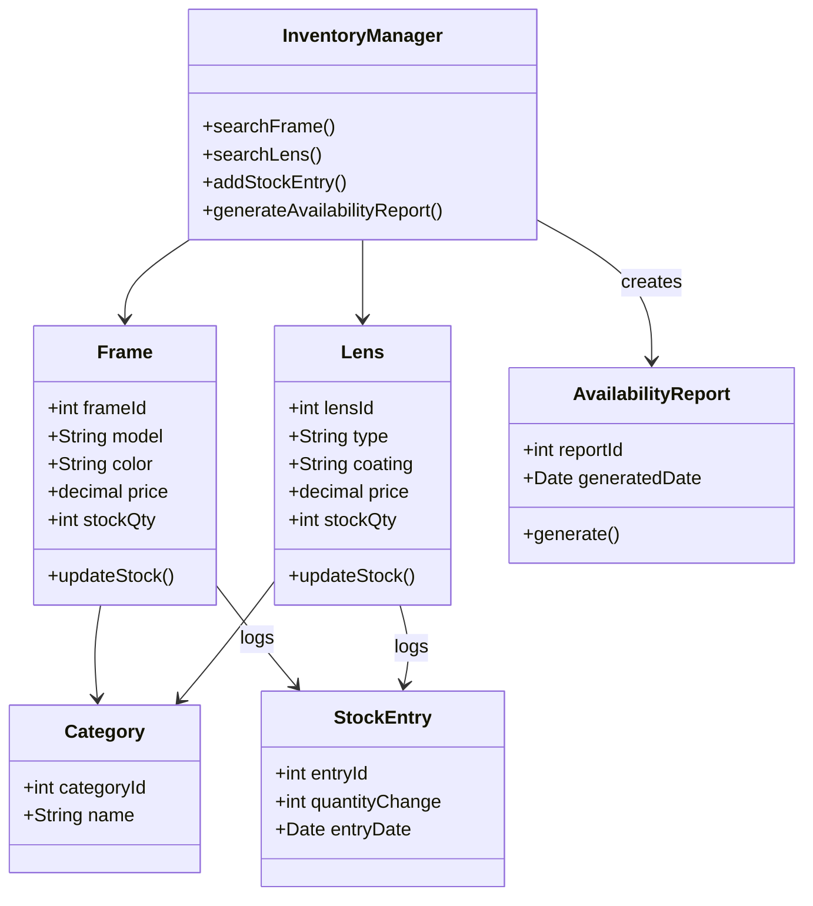
```mermaid
classDiagram
    class Frame {
        +int frameId
        +String model
        +String color
        +decimal price
        +int stockQty
        +updateStock()
    }
    class Lens {
        +int lensId
        +String type
        +String coating
        +decimal price
        +int stockQty
        +updateStock()
    }
    class Category {
        +int categoryId
        +String name
    }
    class StockEntry {
        +int entryId
        +int quantityChange
        +Date entryDate
    }
    class AvailabilityReport {
        +int reportId
        +Date generatedDate
        +generate()
    }
    class InventoryManager {
        +searchFrame()
        +searchLens()
        +addStockEntry()
        +generateAvailabilityReport()
    }

    Frame --> Category
    Lens --> Category
    Frame --> StockEntry : logs
    Lens --> StockEntry : logs
    InventoryManager --> Frame
    InventoryManager --> Lens
    InventoryManager --> AvailabilityReport : creates
```

---

### Welikuburawatta M.D.L - Progressive Line, Discount Update & New Stock Update

**Use Case Diagram**
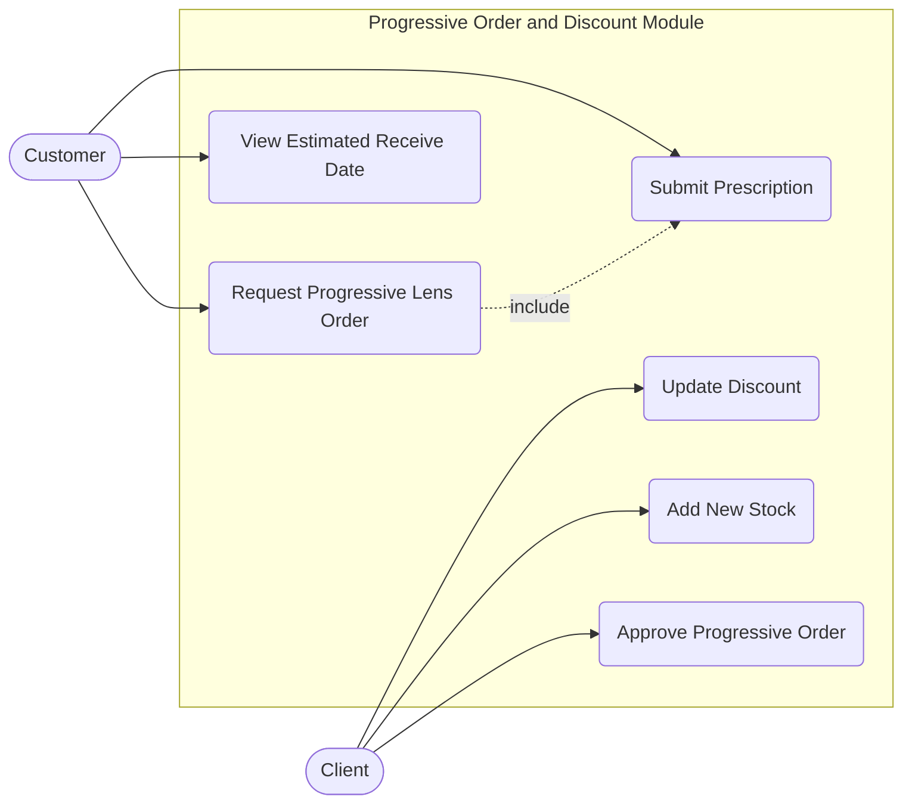
```mermaid
flowchart LR
    Customer([Customer])
    Client([Client])

    subgraph Progressive Order and Discount Module
        UC1(Submit Prescription)
        UC2(Request Progressive Lens Order)
        UC3(View Estimated Receive Date)
        UC4(Update Discount)
        UC5(Add New Stock)
        UC6(Approve Progressive Order)
    end

    Customer --> UC1
    Customer --> UC2
    Customer --> UC3
    Client --> UC4
    Client --> UC5
    Client --> UC6
    UC2 -.include.-> UC1
```

**EER Diagram**
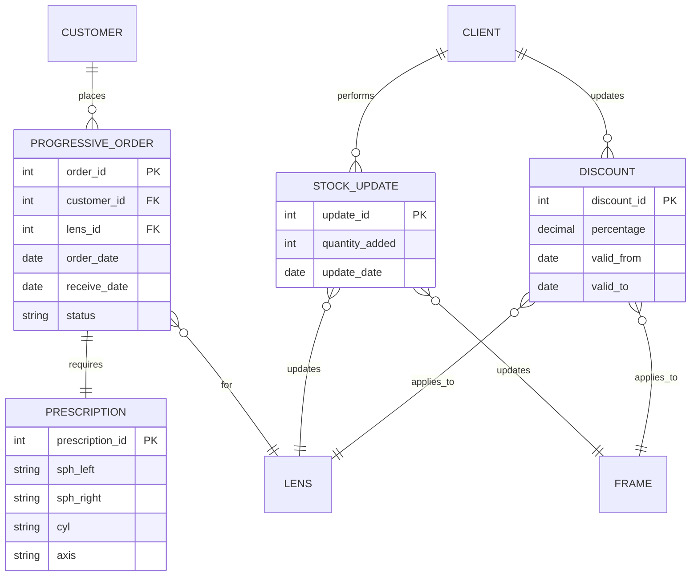
```mermaid
erDiagram
    CUSTOMER ||--o{ PROGRESSIVE_ORDER : places
    PROGRESSIVE_ORDER ||--|| PRESCRIPTION : requires
    PROGRESSIVE_ORDER }o--|| LENS : for
    CLIENT ||--o{ DISCOUNT : updates
    CLIENT ||--o{ STOCK_UPDATE : performs
    STOCK_UPDATE }o--|| LENS : updates
    STOCK_UPDATE }o--|| FRAME : updates
    DISCOUNT }o--|| LENS : applies_to
    DISCOUNT }o--|| FRAME : applies_to

    PROGRESSIVE_ORDER {
        int order_id PK
        int customer_id FK
        int lens_id FK
        date order_date
        date receive_date
        string status
    }
    PRESCRIPTION {
        int prescription_id PK
        string sph_left
        string sph_right
        string cyl
        string axis
    }
    DISCOUNT {
        int discount_id PK
        decimal percentage
        date valid_from
        date valid_to
    }
    STOCK_UPDATE {
        int update_id PK
        int quantity_added
        date update_date
    }
```

**Class Diagram**
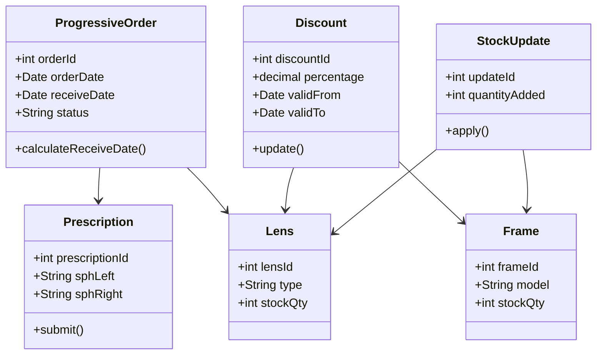
```mermaid
classDiagram
    class ProgressiveOrder {
        +int orderId
        +Date orderDate
        +Date receiveDate
        +String status
        +calculateReceiveDate()
    }
    class Prescription {
        +int prescriptionId
        +String sphLeft
        +String sphRight
        +submit()
    }
    class Discount {
        +int discountId
        +decimal percentage
        +Date validFrom
        +Date validTo
        +update()
    }
    class StockUpdate {
        +int updateId
        +int quantityAdded
        +apply()
    }
    class Lens {
        +int lensId
        +String type
        +int stockQty
    }
    class Frame {
        +int frameId
        +String model
        +int stockQty
    }

    ProgressiveOrder --> Prescription
    ProgressiveOrder --> Lens
    Discount --> Lens
    Discount --> Frame
    StockUpdate --> Lens
    StockUpdate --> Frame
```

---

### Karunarathna KHMMM - To-Do Work Flow, Monthly Report & Dealer Communication

**Use Case Diagram**
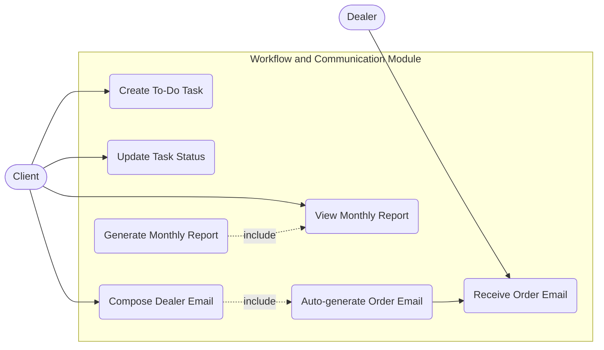
```mermaid
flowchart LR
    Client([Client])
    Dealer([Dealer])

    subgraph Workflow and Communication Module
        UC1(Create To-Do Task)
        UC2(Update Task Status)
        UC3(View Monthly Report)
        UC4(Generate Monthly Report)
        UC5(Compose Dealer Email)
        UC6(Auto-generate Order Email)
        UC7(Receive Order Email)
    end

    Client --> UC1
    Client --> UC2
    Client --> UC3
    Client --> UC5
    Dealer --> UC7
    UC4 -.include.-> UC3
    UC5 -.include.-> UC6
    UC6 --> UC7
```

**EER Diagram**
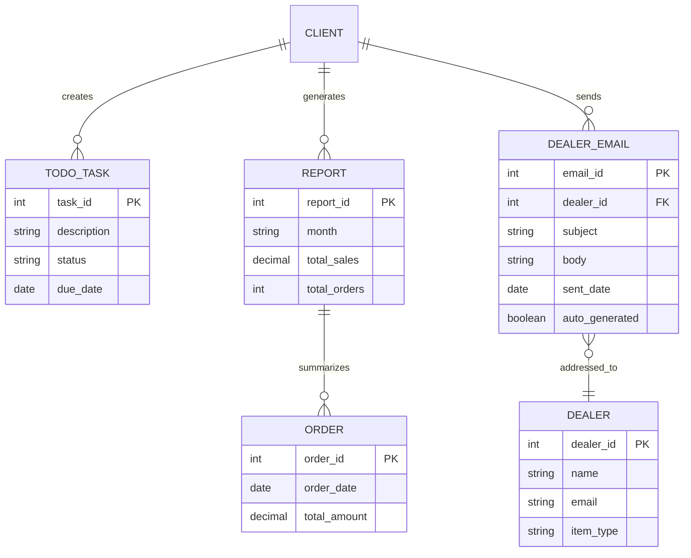
```mermaid
erDiagram
    CLIENT ||--o{ TODO_TASK : creates
    CLIENT ||--o{ REPORT : generates
    CLIENT ||--o{ DEALER_EMAIL : sends
    DEALER_EMAIL }o--|| DEALER : addressed_to
    REPORT ||--o{ ORDER : summarizes

    TODO_TASK {
        int task_id PK
        string description
        string status
        date due_date
    }
    REPORT {
        int report_id PK
        string month
        decimal total_sales
        int total_orders
    }
    DEALER {
        int dealer_id PK
        string name
        string email
        string item_type
    }
    DEALER_EMAIL {
        int email_id PK
        int dealer_id FK
        string subject
        string body
        date sent_date
        boolean auto_generated
    }
    ORDER {
        int order_id PK
        date order_date
        decimal total_amount
    }
```

**Class Diagram**
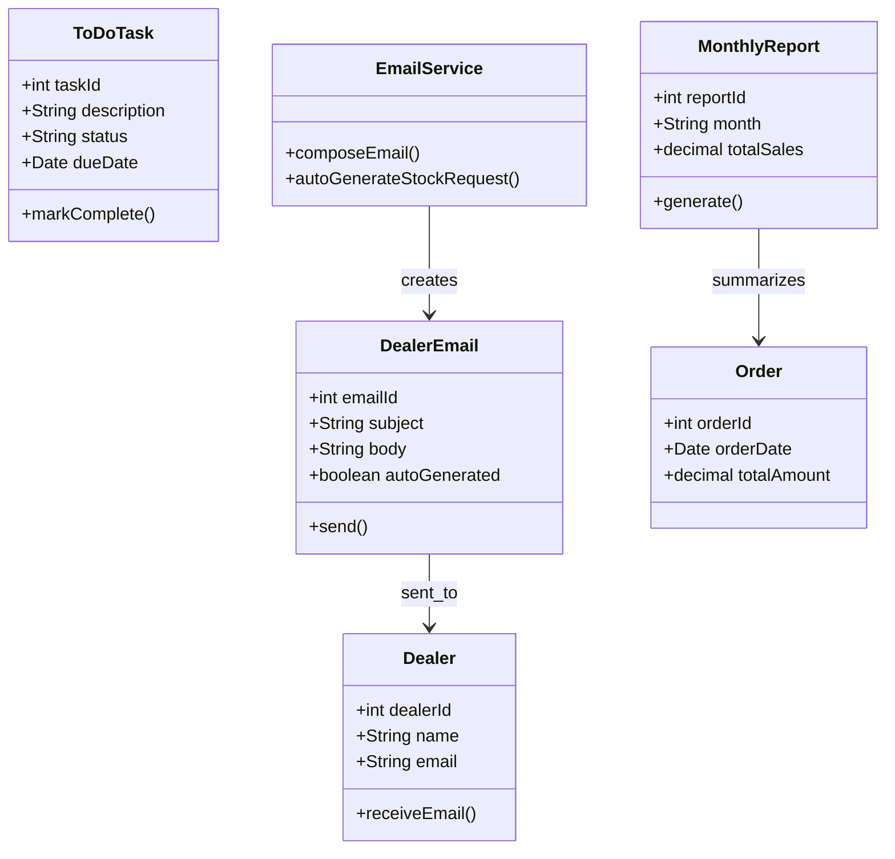
```mermaid
classDiagram
    class ToDoTask {
        +int taskId
        +String description
        +String status
        +Date dueDate
        +markComplete()
    }
    class MonthlyReport {
        +int reportId
        +String month
        +decimal totalSales
        +generate()
    }
    class DealerEmail {
        +int emailId
        +String subject
        +String body
        +boolean autoGenerated
        +send()
    }
    class Dealer {
        +int dealerId
        +String name
        +String email
        +receiveEmail()
    }
    class EmailService {
        +composeEmail()
        +autoGenerateStockRequest()
    }
    class Order {
        +int orderId
        +Date orderDate
        +decimal totalAmount
    }

    EmailService --> DealerEmail : creates
    DealerEmail --> Dealer : sent_to
    MonthlyReport --> Order : summarizes
```

---

### Kankanamge P M G - Payment & Billing

**Use Case Diagram**
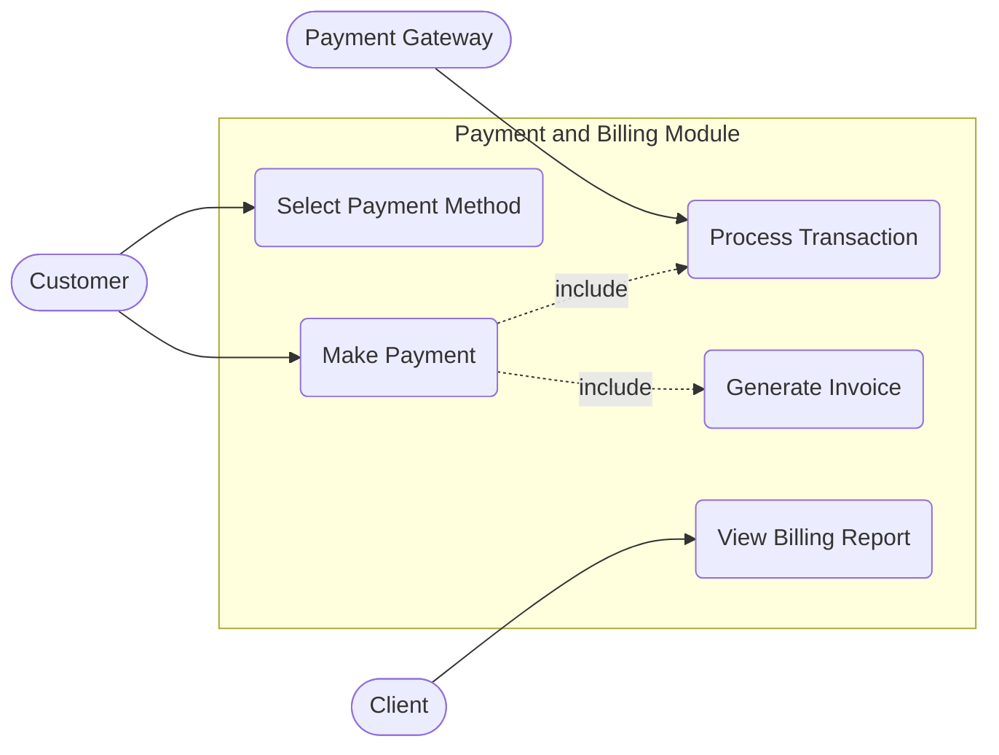
```mermaid
flowchart LR
    Customer([Customer])
    PayGate([Payment Gateway])
    Client([Client])

    subgraph Payment and Billing Module
        UC1(Select Payment Method)
        UC2(Make Payment)
        UC3(Process Transaction)
        UC4(Generate Invoice)
        UC5(View Billing Report)
    end

    Customer --> UC1
    Customer --> UC2
    PayGate --> UC3
    Client --> UC5
    UC2 -.include.-> UC3
    UC2 -.include.-> UC4
```

**EER Diagram**
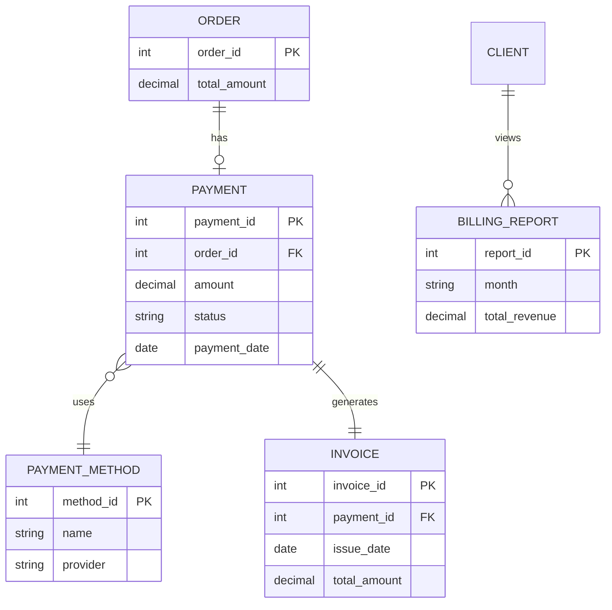
```mermaid
erDiagram
    ORDER ||--o| PAYMENT : has
    PAYMENT }o--|| PAYMENT_METHOD : uses
    PAYMENT ||--|| INVOICE : generates
    CLIENT ||--o{ BILLING_REPORT : views

    PAYMENT {
        int payment_id PK
        int order_id FK
        decimal amount
        string status
        date payment_date
    }
    PAYMENT_METHOD {
        int method_id PK
        string name
        string provider
    }
    INVOICE {
        int invoice_id PK
        int payment_id FK
        date issue_date
        decimal total_amount
    }
    ORDER {
        int order_id PK
        decimal total_amount
    }
    BILLING_REPORT {
        int report_id PK
        string month
        decimal total_revenue
    }
```

**Class Diagram**
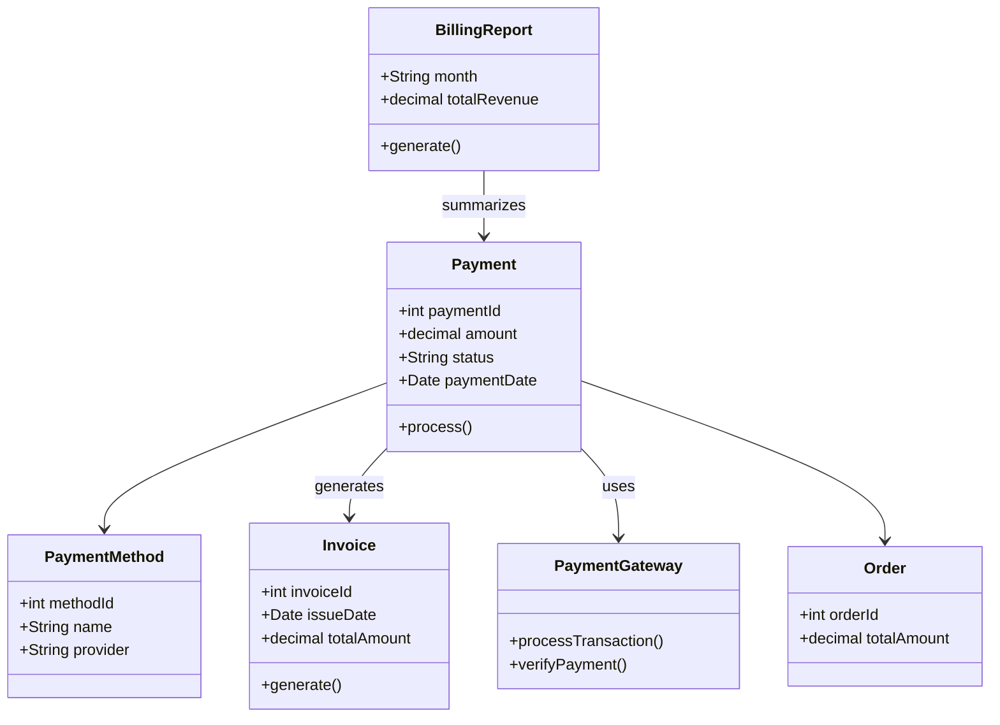
```mermaid
classDiagram
    class Payment {
        +int paymentId
        +decimal amount
        +String status
        +Date paymentDate
        +process()
    }
    class PaymentMethod {
        +int methodId
        +String name
        +String provider
    }
    class Invoice {
        +int invoiceId
        +Date issueDate
        +decimal totalAmount
        +generate()
    }
    class PaymentGateway {
        +processTransaction()
        +verifyPayment()
    }
    class Order {
        +int orderId
        +decimal totalAmount
    }
    class BillingReport {
        +String month
        +decimal totalRevenue
        +generate()
    }

    Payment --> PaymentMethod
    Payment --> Invoice : generates
    Payment --> PaymentGateway : uses
    Payment --> Order
    BillingReport --> Payment : summarizes
```